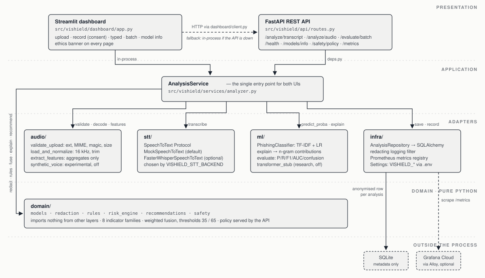
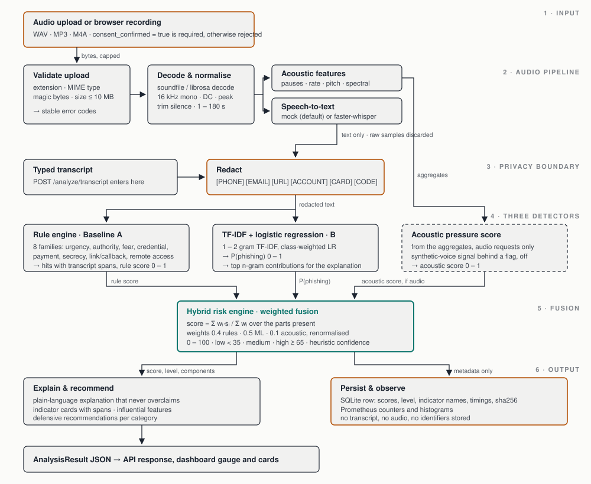

# ViShield — Explainable Voice Phishing Detection and Awareness Platform

[](https://github.com/sathpal/vishield/actions/workflows/ci.yml)


> **⚠️ ACADEMIC DEFENSIVE PROTOTYPE.** ViShield analyses *synthetic, public-domain or explicitly
> consented* recordings and transcripts to teach people how voice-phishing (vishing) works.
> It never places calls, never impersonates anyone, never clones voices, never collects
> credentials and never generates phishing content. Outputs are **potential indicators that
> require human review**, not proof that a caller is malicious or that audio is AI-generated.

Python 3.11 · FastAPI · Streamlit · scikit-learn · librosa · SQLite · Docker · GitHub Actions.
Built as an academic project by a small team.

**New to the project? Start here**

1. [docs/SETUP_AND_EVALUATION.md](docs/SETUP_AND_EVALUATION.md) — step-by-step install, run, test and evaluate (with troubleshooting).
2. [docs/PROJECT_PLAN.md](docs/PROJECT_PLAN.md) — phases, dated milestones, week-by-week tasks per area owner.
3. [.github/ISSUE_PLAN.md](.github/ISSUE_PLAN.md) — the 43-issue backlog to create on GitHub.
4. [docs/ETHICS_AND_SAFETY.md](docs/ETHICS_AND_SAFETY.md) — read and agree before writing code.

## Architecture at a glance





Full-size diagrams and the data-to-metrics pipeline: [docs/diagrams/](docs/diagrams/) and
[docs/ARCHITECTURE.md](docs/ARCHITECTURE.md).

## What it does

1. Accepts a WAV/MP3/M4A upload, a consent-gated browser recording, or a typed transcript.
2. Validates MIME type, magic bytes, size and duration; normalises audio in memory.
3. Transcribes through a replaceable speech-to-text interface (mock by default, local
   `faster-whisper` optional).
4. **Redacts** phone numbers, emails, URLs, account/card numbers and OTP-like codes.
5. Runs three progressively stronger detectors:
   * **Baseline A** – rule engine covering 8 indicator families (urgency, authority, fear/threat,
     credential request, payment request, secrecy, suspicious link/callback, remote access).
   * **Baseline B** – TF-IDF (1–2 gram) + logistic regression with per-prediction feature
     attributions.
   * **Hybrid** – configurable weighted fusion of rule score, ML probability and an optional
     acoustic heuristic.
6. Returns a 0–100 risk score, low/medium/high level, confidence aid, indicator cards with
   transcript spans, influential text features, a plain-language explanation and defensive
   recommendations.
7. Persists only anonymised metadata (scores, indicator names, timings, model version) to SQLite.

## Quick start (any laptop, no GPU, no paid services)

```bash
git clone https://github.com/sathpal/vishield.git && cd vishield
make setup            # or: make setup-uv   (creates .venv, installs [dev] extras, copies .env)
make data             # validate the fictional dataset and create train/val/test splits
make train            # train the TF-IDF + logistic-regression baseline (seconds)
make evaluate         # rules vs ML vs hybrid on the held-out test split -> reports/metrics.json
make run              # API on http://localhost:8000/docs, dashboard on http://localhost:8501
```

Run `make check` (Ruff + mypy strict + pytest) before every pull request.

## How to evaluate

* **Model metrics**: `make evaluate` scores the held-out test split with rules, ML and hybrid and
  writes `reports/metrics.json` (table below). Seeds are fixed, so a fresh clone reproduces it exactly.
* **Batch through the API/dashboard**: `POST /evaluate/batch` or the dashboard **Batch** page.
* **Experiments E1–E4**: commands and results in [docs/EXPERIMENTS.md](docs/EXPERIMENTS.md).
* **Manual dashboard checks M1–M9**: [docs/TEST_PLAN.md](docs/TEST_PLAN.md).
* **Project deliverables and assessment**: [docs/PROJECT_PLAN.md](docs/PROJECT_PLAN.md).

Full walkthrough: [docs/SETUP_AND_EVALUATION.md](docs/SETUP_AND_EVALUATION.md).

If `python3.11` is not on your PATH, install it with `uv python install 3.11` or pyenv and run
`make setup PY=/path/to/python3.11`.

### Optional local speech-to-text

```bash
make install-stt                  # installs faster-whisper (CPU int8)
echo VISHIELD_STT_BACKEND=whisper >> .env
```

The first run downloads the `base` model (~150 MB). Without it, the `mock` backend returns a
fixed placeholder transcript, so use the **Typed transcript** tab for demos and CI.

MP3/M4A decoding needs `ffmpeg` on your PATH (`brew install ffmpeg`, `apt install ffmpeg`).
WAV works with no extra system packages. The Docker image includes ffmpeg.

### Docker

```bash
make docker-up        # builds image, trains baseline inside the image, starts API + dashboard
```

## Repository layout

```
vishield/
├── src/vishield/
│   ├── config.py            # pydantic-settings; every limit/weight/path is configurable
│   ├── domain/              # pure logic: schemas, redaction, rules, risk engine, recommendations, safety policy
│   ├── audio/               # validation, normalisation, aggregate features, experimental synthetic-voice signal
│   ├── stt/                 # SpeechToText Protocol, mock backend, faster-whisper adapter, factory
│   ├── ml/                  # dataset records/splits, TF-IDF+LR classifier, metrics, transformer stub (off)
│   ├── services/analyzer.py # orchestration used by API and dashboard
│   ├── infra/               # SQLAlchemy models, repository, redacting logger
│   ├── api/                 # FastAPI app, routes, centralised error handling
│   └── dashboard/           # Streamlit UI + API/in-process client
├── data/                    # schema.json, starter_dataset.jsonl (80 fictional samples), splits/
├── scripts/                 # validate_dataset, split_dataset, train_model, evaluate_model, redact_text
├── tests/                   # 100+ unit, contract, integration and fairness tests (STT mocked)
├── docs/                    # academic documentation (plan, SRS, architecture, ethics, cards, viva…)
├── .github/                 # CI workflows, issue/PR templates, CODEOWNERS, dependabot, issue plan
├── Dockerfile · docker-compose.yml · Makefile · pyproject.toml · .env.example
```

## API

| Method | Path | Purpose |
|---|---|---|
| GET | `/health` | liveness, model + STT backend status |
| POST | `/analyze/transcript` | analyse typed text `{ "transcript": "..." }` |
| POST | `/analyze/audio` | multipart `file` + `consent_confirmed=true` |
| POST | `/evaluate/batch` | score many items; metrics if labels supplied |
| GET | `/models/info` | model version, weights, thresholds, feature flags |
| GET | `/safety/policy` | permitted/prohibited uses and data handling |
| GET | `/metrics` | Prometheus metrics (anonymised aggregates) |

Interactive docs at `/docs`. Errors are `{ "error": { "code", "message" } }` with stable codes
(`audio_too_large`, `audio_bad_extension`, `empty_transcript`, `stt_unavailable`, …).

## Current evaluation (held-out test split, n = 20, fictional data)

Produced by `make evaluate` on 2026-09-14. **These numbers describe a tiny synthetic dataset and
say nothing about real-world performance.** See `docs/EXPERIMENTS.md`.

| Detector | Accuracy | Precision | Recall | F1 | ROC-AUC |
|---|---|---|---|---|---|
| Rules only (Baseline A) | 0.85 | 1.00 | 0.79 | 0.88 | 0.95 |
| TF-IDF + LR (Baseline B) | 0.85 | 0.82 | 1.00 | 0.90 | 0.99 |
| Hybrid (0.4 rules / 0.5 ML) | 0.95 | 0.93 | 1.00 | 0.97 | 0.99 |

## Metrics and Grafana Cloud

The API exposes Prometheus metrics at `/metrics` (anonymised aggregates only). `observability/`
contains an Alloy pipeline that ships them to Grafana Cloud and a dashboard-as-code script:

```bash
make observability-up   # Alloy scrapes localhost:8000/metrics -> Grafana Cloud (needs observability/.env)
make dashboard          # push the "ViShield — Voice Phishing Detection Overview" dashboard
make traffic            # replay fictional transcripts to populate the panels
```

See [observability/README.md](observability/README.md).

## Configuration

Copy `.env.example` to `.env`. Every variable is prefixed `VISHIELD_` and documented there:
file/duration limits, STT backend, fusion weights, thresholds, database URL, model path and the
**development-only** `VISHIELD_DEV_STORE_AUDIO` flag (default `false`; ignored in production).

## Team

| Area owner | Ownership |
|---|---|
| 1 | audio pipeline & speech-to-text |
| 2 | dataset, NLP model & evaluation |
| 3 | backend, database & risk engine |
| 4 | dashboard, documentation & demonstration |

Everyone writes tests, reviews pull requests and presents. See `docs/PROJECT_PLAN.md`.

## Documentation

`docs/` contains the project plan, SRS, architecture, threat model, ethics & safety, literature
review guide, methodology, dataset and model cards, test plan, experiments, final-report outline,
demo guide and viva questions. Start with [docs/PROJECT_PLAN.md](docs/PROJECT_PLAN.md).

## License

MIT. Dataset text is CC0. No third-party audio or model weights are included.
