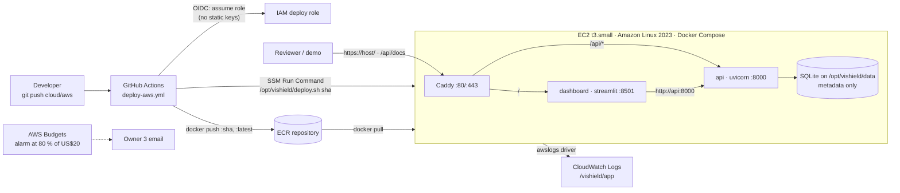

# Hosting ViShield on AWS

This is the runbook for the `cloud/aws` branch. The local setup in the README is for
development and testing; this document takes the same Docker image to a public URL on AWS,
and back down again, with one command each way.

## Architecture



| Piece | Where it is defined |
|---|---|
| Infrastructure (ECR, security group, IAM, EC2, Elastic IP, logs, budget, GitHub OIDC role) | `deploy/aws/terraform/*.tf` |
| What runs on the instance | `deploy/aws/docker-compose.prod.yml`, `deploy/aws/Caddyfile`, installed by `user_data.sh.tpl` into `/opt/vishield/` |
| Deployment | `.github/workflows/deploy-aws.yml` (push to `cloud/aws` or manual run), or `make cloud-push cloud-deploy` |
| Operations | `make cloud-shell` (Session Manager), CloudWatch log group `/vishield/app`, `make cloud-destroy` |

Why this shape: one small instance runs all three containers, so Streamlit's websockets and the
SQLite file need no extra services; the image is the same one CI builds and `make docker-up`
runs; there is no SSH port and no long-lived AWS key anywhere.

## Cost

Approximate, ap-south-1 (Mumbai), on-demand, September 2026 prices; check the AWS pricing page
before you commit:

| Item | Per month |
|---|---|
| EC2 t3.small, 24 × 7 | about US$15 |
| 20 GB gp3 root volume | about US$2 |
| Elastic IP while attached to a running instance, ECR storage, CloudWatch logs | under US$2 |
| **Total** | **about US$20** |

The budget alarm emails at 80 % of the limit. Destroy the environment after the presentation;
re-creating it takes about ten minutes.

## Prerequisites

1. An AWS account with an IAM Identity Center user (or IAM user) that has `AdministratorAccess`
   for the person running Terraform. Ask the supervisor for access in week 7.
2. On the deployer's laptop: AWS CLI v2, Terraform 1.6 or newer, Docker, `make`, `git`.
   macOS: `brew install awscli terraform`. Windows: use WSL2 (see `docs/SETUP_AND_EVALUATION.md`).
3. `aws configure sso` (or `aws configure`), then `aws sts get-caller-identity` shows your account.

## 1. Create the environment

```bash
git checkout cloud/aws
cp deploy/aws/terraform/terraform.tfvars.example deploy/aws/terraform/terraform.tfvars
# edit terraform.tfvars: budget_email at least; domain if you have one
make cloud-init
make cloud-plan          # read it: ~15 resources, nothing outside this project's tags
make cloud-apply         # type "yes"
make cloud-output
```

Outputs you will need:

| Output | Used for |
|---|---|
| `public_url` | where the dashboard is; API at `<public_url>/api/docs` |
| `github_deploy_role_arn` | GitHub variable `AWS_DEPLOY_ROLE_ARN` |
| `ecr_repository_url` | GitHub variable `ECR_REPOSITORY` is the last path segment (`vishield`) |
| `instance_id` | optional GitHub variable `EC2_INSTANCE_ID` (the workflow can also find it by tag) |

The instance boots, installs Docker, writes `/opt/vishield/`, and tries to pull an image. On the
very first run there is no image yet, which is expected; step 2 provides it.

## 2. First deployment

Either path produces the same result.

**Path A, from GitHub (recommended).** In the repository settings, add these Actions
*variables* (not secrets): `AWS_REGION` (`ap-south-1`), `AWS_DEPLOY_ROLE_ARN`, `ECR_REPOSITORY`
(`vishield`), `APP_URL` (the `public_url` output). Then push any commit to `cloud/aws`, or run
**Deploy to AWS** from the Actions tab. The workflow builds the image, pushes it as `:<sha>` and
`:latest`, runs the deploy script on the instance through SSM and checks `/api/health`.

**Path B, from your laptop.**

```bash
make cloud-push          # docker build + push :latest to ECR
make cloud-deploy        # SSM: pull and restart on the instance
```

## 3. Verify

```bash
URL=$(terraform -chdir=deploy/aws/terraform output -raw public_url)
curl -s $URL/api/health
curl -s -X POST $URL/api/analyze/transcript -H 'Content-Type: application/json' \
  -d '{"transcript": "This is your bank. Share the OTP now or the account will be closed."}'
open $URL            # dashboard; API docs at $URL/api/docs
```

Run the manual checks M1 to M9 from `docs/TEST_PLAN.md` against the hosted dashboard and record
the date in the test plan.

## 4. Operate

| Task | How |
|---|---|
| See logs | CloudWatch console, log group `/vishield/app`, streams `api`, `dashboard`, `caddy`; or `aws logs tail /vishield/app --follow` |
| Shell on the instance | `make cloud-shell`, then `sudo docker compose -f /opt/vishield/docker-compose.yml ps` |
| Redeploy the current branch | push to `cloud/aws`, or `make cloud-push cloud-deploy` |
| Roll back | Actions tab, run **Deploy to AWS** with `tag` set to a previous 12-character SHA; or `make cloud-deploy TAG=<sha>` |
| Change instance size, region, ingress | edit `terraform.tfvars`, `make cloud-apply` |
| Enable HTTPS | point a DNS A record at `public_ip`, set `domain` in `terraform.tfvars`, `make cloud-apply` (the instance is re-created with the new Caddy address and gets a certificate automatically) |
| Protect the dashboard | uncomment the `basic_auth` block in `deploy/aws/Caddyfile`, paste a hash from `docker run --rm caddy:2.8-alpine caddy hash-password --plaintext '...'`, `make cloud-apply` |
| Restrict who can reach it | set `allowed_ingress_cidrs` to the college network in `terraform.tfvars` |

## 5. Tear down

```bash
make cloud-destroy       # type "yes"; removes the instance, IP, ECR images, logs, roles, budget
```

Confirm in Cost Explorer a day later that the daily cost is zero. State stays in
`deploy/aws/terraform/terraform.tfstate` on the deployer's laptop (git-ignored); keep it until
the destroy has finished.

## Security notes for the threat model

* No SSH: the security group opens 80 and 443 only; administration goes through SSM Session
  Manager with the instance role.
* No static credentials: GitHub assumes a role through OIDC that can only push to this ECR
  repository and run commands on this one instance from the `cloud/aws` branch.
* The instance role can pull images and write logs, nothing else. IMDSv2 is enforced, the root
  volume is encrypted.
* The application runs with `VISHIELD_ENV=production`, so the development-only audio retention
  flag is ignored; SQLite holds scores and timings only, never transcripts or audio.
* The dashboard is public unless you enable basic auth or restrict the CIDR. There is no real
  data in the system, but a public demo can still be abused for load; keep the upload limits and
  destroy the environment when it is not needed.
* `/api/metrics` exposes anonymised Prometheus aggregates. Remove the `handle_path /api/*` route
  for it in the Caddyfile if the reviewers prefer it private.

## Troubleshooting

| Symptom | Fix |
|---|---|
| Workflow fails at "Assume the deploy role" | `AWS_DEPLOY_ROLE_ARN` variable missing or wrong; the workflow must run on `cloud/aws` (the role trusts that branch only) |
| `deploy.sh` cannot pull: `no basic auth credentials` | instance role missing ECR permissions, or wrong region in `/opt/vishield/.env`; re-run `make cloud-apply` |
| Instance shows nothing on port 80 | first boot takes 3 to 5 minutes; check `/var/log/cloud-init-output.log` from `make cloud-shell` |
| Streamlit page loads but stays blank | websocket blocked by a corporate proxy; try another network, or add the domain and HTTPS |
| Certificate not issued after setting `domain` | DNS A record must resolve to `public_ip` before Caddy starts; `docker compose restart caddy` from the shell |
| `terraform apply` fails on the OIDC provider "already exists" | set `create_github_oidc_provider = false` in `terraform.tfvars` |
