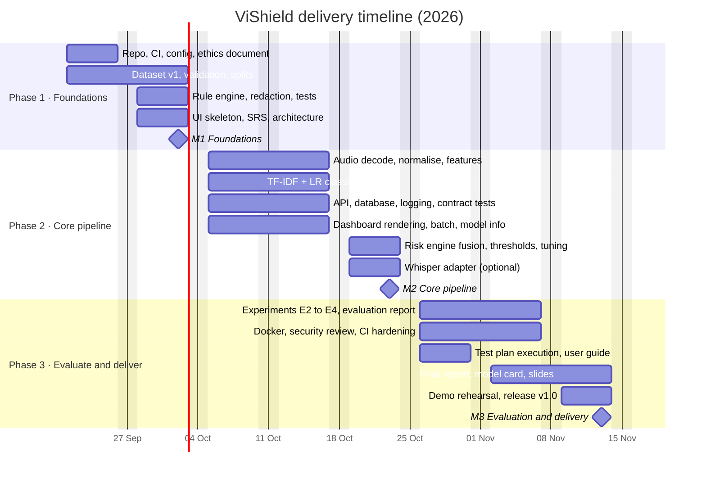

# Project plan and timeline — ViShield

Eight weeks, three phases, four area owners. The project starts Monday 21 September 2026 and
ends with the final presentation on Friday 13 November 2026. If a cohort starts on a different
Monday, shift every date by the same offset; week numbers, tasks and issue numbers stay the same.

Contents: [Goal and scope](#1-goal-and-scope) · [Team](#2-team-and-ownership) ·
[Timeline](#3-timeline) · [Phase 1](#4-phase-1--foundations-weeks-12) ·
[Phase 2](#5-phase-2--core-pipeline-weeks-35) · [Phase 3](#6-phase-3--evaluate-and-deliver-weeks-68) ·
[Milestones and assessment](#7-milestones-and-assessment) · [Ways of working](#8-ways-of-working) ·
[Risks](#9-risks) · [Deliverables checklist](#10-deliverables-checklist)

---

## 1. Goal and scope

**Goal.** Deliver a runnable, tested, documented prototype that explains *why* a call
transcript looks like voice phishing, using only synthetic or consented data and defensive
techniques, and answer one research question with evidence: does fusing a rule engine with a
small explainable classifier beat either alone?

**Objectives**

| ID | Objective | Evidence at the end |
|---|---|---|
| O1 | Explainable indicators for every result | Indicator cards with transcript spans, feature attributions, plain-language explanation |
| O2 | Safe handling of audio and text | Consent gating, validation, redaction, no transcript or audio persisted, tests proving it |
| O3 | Measurable baselines and an honest comparison | Rules vs ML vs hybrid on a held-out split, error analysis, confidence intervals |
| O4 | A usable dashboard and API | Manual test cases M1–M9 passing, API contract tests, 10-minute demo |
| O5 | Documented ethics, threat model and limitations | Ethics document, threat model, model card, dataset card, limitations page |

**In scope**: WAV/MP3/M4A upload, consent-gated browser recording, typed transcripts, mock and
local Whisper speech-to-text, rule engine, TF-IDF + logistic regression, weighted fusion,
recommendations, SQLite metadata, FastAPI, Streamlit, Docker, CI, Prometheus metrics.

**Out of scope, by policy**: placing or receiving calls, impersonation, voice cloning,
credential capture, generating phishing content, real customer data, real-time call
interception, any claim that audio is "proven" AI-generated. See `docs/ETHICS_AND_SAFETY.md`.

**Stretch, only after M3 criteria are met**: transformer classifier behind its flag (E5),
multilingual samples through the consent process, user study on explanation clarity.

## 2. Team and ownership

Four area owners; every area has a named backup who is consulted on its pull requests and
takes over if the owner is unavailable. Everyone writes tests, reviews and presents.

| Owner | Area | Directories | Backup |
|---|---|---|---|
| Owner 1 | Audio pipeline and speech-to-text | `src/vishield/audio/`, `src/vishield/stt/` | Owner 3 |
| Owner 2 | Dataset, NLP model, evaluation, experiments | `data/`, `src/vishield/ml/`, `scripts/` | Owner 4 |
| Owner 3 | Backend, database, risk engine, API, Docker, CI | `src/vishield/domain/`, `services/`, `infra/`, `api/`, `.github/` | Owner 1 |
| Owner 4 | Dashboard, documentation, report, demo | `src/vishield/dashboard/`, `docs/`, `README.md` | Owner 2 |

Responsibility matrix (R = responsible, A = accountable, C = consulted, I = informed):

| Area | O1 | O2 | O3 | O4 |
|---|---|---|---|---|
| Audio validation, normalisation, features | **R/A** | C | C | I |
| Speech-to-text adapters | **R/A** | I | C | I |
| Dataset, validation scripts, cards | C | **R/A** | I | C |
| NLP model, evaluation, experiments | I | **R/A** | C | I |
| Rules, redaction, risk engine | C | C | **R/A** | I |
| API, DB, logging, Docker, CI | I | I | **R/A** | C |
| Dashboard | I | C | C | **R/A** |
| Documentation and report | C | C | C | **R/A** |
| Tests, PR reviews, final presentation | R | R | R | R |

Map the owners to GitHub handles in `.github/CODEOWNERS` in week 1.

## 3. Timeline

### Phases at a glance

| Phase | Weeks | Dates | Goal | Milestone due |
|---|---|---|---|---|
| 1 Foundations | 1–2 | 21 Sep – 2 Oct | A repository everyone can run, a validated dataset, the rule baseline, the ethics boundary agreed in writing | **M1** Fri 2 Oct |
| 2 Core pipeline | 3–5 | 5 Oct – 23 Oct | The full path from audio or text to an explained risk score, end to end, through API and dashboard | **M2** Fri 23 Oct |
| 3 Evaluate and deliver | 6–8 | 26 Oct – 13 Nov | Honest evaluation, hardened delivery, and a report, slides and demo that can be defended | **M3** Fri 13 Nov |

### Calendar of checkpoints

| Date | Event | What must be ready | Who runs it |
|---|---|---|---|
| Mon 21 Sep | Kick-off | Repo cloned and running on every laptop; owners assigned; labels, milestones and issues created from `.github/ISSUE_PLAN.md` | Owner 3 |
| Thu 24 Sep | Ethics review meeting | Everyone has read `docs/ETHICS_AND_SAFETY.md` and `docs/THREAT_MODEL.md`; consent policy signed; supervisor sign-off on scope | Owner 4 |
| Fri 2 Oct | Sprint review 1 and **M1** | CI green, dataset validated, rule baseline with tests, SRS and architecture drafts, dashboard skeleton | Owner 4 |
| Fri 9 Oct | Test-writing pairs | Each pair adds tests for the other's area; coverage report reviewed | All |
| Fri 16 Oct | Sprint review 2 | Audio pipeline, classifier, API and dashboard each demonstrable on their own | Owner 4 |
| Fri 23 Oct | Integration day and **M2** | End-to-end demo for a typed transcript and a WAV upload; contract tests passing; weights tuned on validation split | Owner 3 |
| Thu 29 Oct | Threat-model walkthrough | `docs/THREAT_MODEL.md` checked against the running system; findings turned into issues | Owner 3 |
| Fri 6 Nov | Report review | Full draft of the final report covering all 20 sections; model and dataset cards final | Owner 4 |
| Wed 11 Nov | Demo dress rehearsal | 10-minute demo from a fresh clone, timed; viva question bank rehearsed | All |
| Fri 13 Nov | Final presentation and **M3** | Experiments E1–E4 recorded, coverage ≥ 70 %, Docker build, report, slides, demo, release v1.0 | All |

Weekly rhythm: stand-up Monday 15 minutes (blockers only), review meeting Friday, pull requests
reviewed within one working day.

## 4. Phase 1 — Foundations (weeks 1–2)

**Dates**: Mon 21 Sep – Fri 2 Oct. **Milestone**: `M1: Foundations`, due Fri 2 Oct.
**Goal**: a repository everyone can run, a validated dataset, the rule baseline, and the ethics
boundary agreed in writing. Issue numbers refer to `.github/ISSUE_PLAN.md`.

### Week 1 (21–25 Sep)

| Owner | Tasks | Deliverable | Issues |
|---|---|---|---|
| Owner 1 | Survey speech-to-text options (mock, faster-whisper, others); define audio format constraints (WAV/MP3/M4A, 16 kHz, 1–180 s) | One-page STT survey in `docs/`; `SpeechToText` Protocol agreed | #9 |
| Owner 2 | Draft `data/schema.json`; write the first 40 fictional samples across 10 categories; start the literature list | Schema merged; 40 samples passing validation | #4, #13 |
| Owner 3 | Repository skeleton, `pyproject.toml`, `Makefile`, `.env.example`, config module; CI with ruff, mypy, pytest, coverage, pip-audit, gitleaks, Docker build | `make check` and CI green on an empty package | #1, #2 |
| Owner 4 | README with the ethics banner; SRS draft; ethics and safety policy document; in-code policy endpoint text | `docs/SRS.md`, `docs/ETHICS_AND_SAFETY.md` drafts | #3, #12 |
| All | Kick-off; ethics review meeting; sign the consent policy; create labels, milestones and issues | Signed policy on file; backlog on GitHub | #13 |

### Week 2 (28 Sep – 2 Oct)

| Owner | Tasks | Deliverable | Issues |
|---|---|---|---|
| Owner 1 | Upload validation: extension, MIME type, magic bytes, size cap; path-traversal safety; tests | `audio/validation.py` with tests | #10 |
| Owner 2 | Complete 80 samples; validation script (schema, duplicates, PII patterns, organisation names); deterministic stratified split script; dataset card v1 | `make data` produces splits and a distribution report | #4, #5, #6 |
| Owner 3 | Redaction module (phone, email, URL, account, card, OTP-like codes); rule engine with 8 indicator families, spans and a saturating score; tests including a fairness test across phrasing styles | `domain/redaction.py`, `domain/rules.py` with tests | #7, #8 |
| Owner 4 | Streamlit skeleton: banner, tabs, sidebar; architecture document with the layered diagram | Dashboard runs with placeholder pages; `docs/ARCHITECTURE.md` | #11, #12 |
| All | Sprint review 1: each owner demonstrates their piece; M1 checklist walked through | M1 closed | |

**M1 exit criteria**: repo, CI, ethics document, dataset v1 validated, architecture, UI
skeleton, rule baseline with tests. Nothing in Phase 2 starts until CI is green on `main`.

## 5. Phase 2 — Core pipeline (weeks 3–5)

**Dates**: Mon 5 Oct – Fri 23 Oct. **Milestone**: `M2: Core pipeline`, due Fri 23 Oct.
**Goal**: the full path from audio or text to an explained risk score, end to end, through the
API and the dashboard.

### Week 3 (5–9 Oct)

| Owner | Tasks | Deliverable | Issues |
|---|---|---|---|
| Owner 1 | Decode with soundfile/librosa, resample to 16 kHz mono, DC removal, peak normalisation, silence trim, duration checks; tests with synthetic WAV built in memory | `audio/normalize.py` with tests | #14 |
| Owner 2 | TF-IDF (1–2 gram) + logistic regression training script with model metadata and dataset hash; metrics module (P/R/F1/AUC/confusion) | `make train` writes `models/tfidf_logreg.joblib`; `ml/evaluate.py` | #18, #19, #20 |
| Owner 3 | SQLAlchemy models and repository storing metadata only; redacting logging filter; settings wiring | `infra/db.py`, `infra/repository.py`, `infra/logging.py` with tests | #23, #24 |
| Owner 4 | Result rendering: gauge, indicator cards with highlighted spans, feature bar chart, recommendations | Analyze page renders a full result from the in-process service | #26 |
| All | Test-writing pairs on Fri 9 Oct: Owner 1 with Owner 3, Owner 2 with Owner 4 | Coverage report reviewed | |

### Week 4 (12–16 Oct)

| Owner | Tasks | Deliverable | Issues |
|---|---|---|---|
| Owner 1 | Aggregate acoustic features (pauses, speaking-rate proxy, pitch, spectral) with no frames or embeddings stored; mock STT backend and factory | `audio/features.py`, `stt/mock.py`, `stt/factory.py` with tests | #15, #16 |
| Owner 2 | Per-prediction feature attributions; fairness tests across formal, casual, bureaucratic and terse phrasing; dataset card and model card v1 | `PhishingClassifier.explain`; `docs/DATASET_CARD.md`, `docs/MODEL_CARD.md` | #18, #29, #30 |
| Owner 3 | FastAPI routes (`/health`, `/analyze/transcript`, `/analyze/audio`, `/evaluate/batch`, `/models/info`, `/safety/policy`), centralised error envelope with stable codes, contract tests | `api/routes.py`, `api/errors.py`; `tests/test_api.py` | #25 |
| Owner 4 | Batch evaluation page; model information page | Batch page runs the held-out split and shows metrics and confusion matrix | #27, #28 |
| All | Sprint review 2 on Fri 16 Oct | Each piece demonstrable on its own | |

### Week 5 (19–23 Oct)

| Owner | Tasks | Deliverable | Issues |
|---|---|---|---|
| Owner 1 | faster-whisper adapter as an optional extra with lazy import and a clear `stt_unavailable` error | `stt/whisper_adapter.py`; `make install-stt` documented | #17 |
| Owner 2 | Experiment E2: weight sensitivity on the validation split; pick weights; record in `docs/EXPERIMENTS.md` | E2 table committed; chosen weights in `.env.example` | #32 |
| Owner 3 | Risk engine: weighted fusion with renormalisation, thresholds, heuristic confidence, explanation text; recommendations per category | `domain/risk_engine.py`, `domain/recommendations.py` with tests | #21, #22 |
| Owner 4 | Limitations and ethics page; demo script v1 | `docs/DEMO_GUIDE.md` v1 | #28, #39 |
| All | Integration day Fri 23 Oct: typed transcript and WAV upload end to end through API and dashboard | M2 closed | |

**M2 exit criteria**: audio pipeline, STT adapter, ML classifier, API, database, risk engine
and dashboard working together; contract tests green; `make evaluate` produces
`reports/metrics.json`.

## 6. Phase 3 — Evaluate and deliver (weeks 6–8)

**Dates**: Mon 26 Oct – Fri 13 Nov. **Milestone**: `M3: Evaluation & delivery`, due Fri 13 Nov.
**Goal**: honest evaluation, hardened delivery, and a report, slides and demo that can be
defended in a viva.

### Week 6 (26–30 Oct)

| Owner | Tasks | Deliverable | Issues |
|---|---|---|---|
| Owner 1 | Synthetic-voice heuristic behind a feature flag, labelled experimental; experiment E3 with Owner 2 (acoustic weight 0 vs 0.1 on consented team recordings) | `audio/synthetic_voice.py`; E3 recorded | #31, #33 |
| Owner 2 | Experiment E4 (phrasing robustness); evaluation report; error analysis of every false positive and false negative | `docs/EXPERIMENTS.md` E1–E4 complete | #34 |
| Owner 3 | Dockerfile and compose (model trained at build time); security review against the threat model; rule fixes from error analysis (digit-code pattern, reward-lure family) | `make docker-up` works; findings as issues | #35, #36, #37 |
| Owner 4 | Execute the manual test plan M1–M9; write the user guide section of the report | Test results table in `docs/TEST_PLAN.md` | #38 |
| All | Threat-model walkthrough Thu 29 Oct | Issues for every gap found | #37 |

### Week 7 (2–6 Nov)

| Owner | Tasks | Deliverable | Issues |
|---|---|---|---|
| Owner 1 | Performance profiling of the audio path on a laptop; edge-case tests (silence, clipping, stereo, garbage bytes) | Timing table in the report; tests merged | #38 |
| Owner 2 | Model card final with limitations and intended use; per-category accuracy discussion | `docs/MODEL_CARD.md` final | #30 |
| Owner 3 | CI hardening: dependency audit, secret scan, coverage threshold enforced; release checklist | CI matrix documented; `v1.0` checklist | #2, #43 |
| Owner 4 | Final report draft covering all 20 sections of `docs/FINAL_REPORT_OUTLINE.md`; slide deck | Report draft and slides shared | #40, #41 |
| All | Report review Fri 6 Nov | Review comments turned into issues | #40 |

### Week 8 (9–13 Nov)

| Owner | Tasks | Deliverable | Issues |
|---|---|---|---|
| Owner 1 | Demo rehearsal; own the audio part of the demo and its fallbacks | Rehearsed | #39 |
| Owner 2 | Demo rehearsal; own the batch evaluation and metrics part | Rehearsed | #39 |
| Owner 3 | Tag release `v1.0` with release notes; final CI run from a fresh clone | Release published | #43 |
| Owner 4 | Demo rehearsal; own the narrative and the limitations close; viva preparation from `docs/VIVA_QUESTIONS.md` | Final report and slides submitted | #40, #41, #42 |
| All | Dress rehearsal Wed 11 Nov; final presentation Fri 13 Nov | M3 closed | |

**M3 exit criteria**: explainability polish, full test plan executed, evaluation report,
Docker build, CI green, final report, slides, 10-minute demo, release `v1.0`.

## 7. Milestones and assessment

| Milestone | Due | What is assessed, from the repository as it stands on the day | Weight |
|---|---|---|---|
| M1 Foundations | Fri 2 Oct 2026 | CI green, dataset validated, rule baseline with tests, ethics document, SRS and architecture drafts | 20 % |
| M2 Core pipeline | Fri 23 Oct 2026 | End-to-end demo (transcript and audio), API contract tests, classifier trained, dashboard renders explanations | 30 % |
| M3 Evaluation and delivery | Fri 13 Nov 2026 | Experiments E1–E4 recorded, coverage ≥ 70 %, Docker build, final report, slides, 10-minute demo, viva | 50 % |

Criteria out of 100:

| Criterion | Marks | Evidence |
|---|---|---|
| Working system | 25 | The demo runs from a fresh clone using the README commands; API and dashboard behave as documented |
| Engineering quality | 20 | Tests, type checks and lint pass in CI; layered design respected; pull requests reviewed |
| Evaluation and honesty | 20 | Metrics reproducible with `make evaluate`; error analysis; confidence intervals; no tuning on the test split |
| Explainability and safety | 15 | Indicator spans and feature attributions correct; redaction, consent gating and no-storage policy hold |
| Report and documentation | 10 | Final report follows the 20-section outline; model card, dataset card and threat model complete |
| Presentation and viva | 10 | Each owner can explain their area and answer the viva question bank |

Individual marks are adjusted by contribution evidence: commit history, issues closed, review
activity, and the contribution statement in appendix G of the report.

## 8. Ways of working

**Definition of done for every issue**: code + tests + docs updated, `make check` green
locally, CI green, two approving reviews (the CODEOWNER of the touched directory and one
other team member), issue linked with `Closes #NN`, and the change demonstrable in the
dashboard or with the API.

**Branching**: `main` is always releasable. One branch per issue, named
`<area>/<issue>-<slug>`, for example `audio/14-decode-normalise`. Squash-merge through a pull
request using the template; no direct pushes to `main`.

**Reviews**: reviewed within one working day. Reviewers run the change, not just read it. The
PR template safety checklist must be ticked: no secrets, no model binaries, no audio, no real
person or organisation, no offensive capability.

**Evaluation discipline**: tune on `val.jsonl` only; score `test.jsonl` once, at the end;
never edit the dataset to improve a number; every figure in the report links to the command
that produced it.

**Meetings**: Monday stand-up (15 minutes, blockers only), Friday review, the checkpoints in
section 3. Decisions are written into the relevant document in `docs/`, not left in chat.

## 9. Risks

| Risk | Likelihood | Impact | Mitigation | Owner |
|---|---|---|---|---|
| STT model too slow or large for laptops | Medium | Medium | Mock backend and typed transcripts are the default; Whisper optional; demo uses typed tab | Owner 1 |
| Tiny dataset overfits or misleads | High | High | Report honestly with confidence intervals; stratified splits; rules as floor; add consented samples only through the documented process | Owner 2 |
| Scope creep into offensive features | Low | High | Safety policy in code and served by the API; PR template checkbox; supervisor sign-off at the ethics review | Owner 3 |
| Team member unavailable | Medium | Medium | Named backup per area; shared tests; work tracked in issues, not in heads | All |
| ffmpeg missing on laptops | Medium | Low | WAV path needs no ffmpeg; Docker image bundles it | Owner 1 |
| Windows-only laptop cannot run `make` | Medium | Low | WSL2 recommended; native PowerShell commands documented in `docs/SETUP_AND_EVALUATION.md` | Owner 3 |
| Report left to the last week | Medium | High | Report draft due Fri 6 Nov with a review; sections mapped to existing docs in `docs/FINAL_REPORT_OUTLINE.md` | Owner 4 |

## 10. Deliverables checklist

- [ ] Repository with green CI on `main` and release `v1.0`
- [ ] `make setup && make data && make train && make evaluate && make run` works from a fresh clone
- [ ] `reports/metrics.json` reproduced and quoted in the report
- [ ] `docs/EXPERIMENTS.md` with E1–E4, commands and results
- [ ] `docs/TEST_PLAN.md` with M1–M9 executed and dated
- [ ] `docs/DATASET_CARD.md`, `docs/MODEL_CARD.md`, `docs/THREAT_MODEL.md`, `docs/ETHICS_AND_SAFETY.md` final
- [ ] Final report (40–60 pages) following `docs/FINAL_REPORT_OUTLINE.md`, with appendix G contribution statements
- [ ] Slide deck and a rehearsed 10-minute demo per `docs/DEMO_GUIDE.md`
- [ ] Signed consent policy on file (outside the repository)
