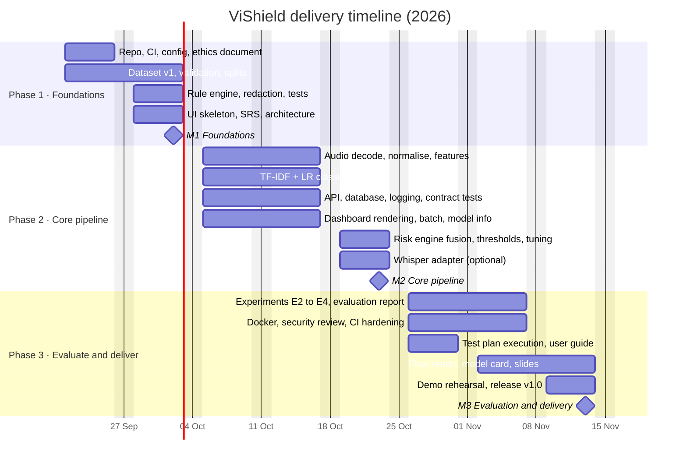

# Timeline

Eight weeks in three phases, starting Monday 21 September 2026 and ending with the final
presentation on Friday 13 November 2026. Each phase closes with a GitHub milestone that must be
fully green before the next one opens. If a cohort starts on a different Monday, shift every
date by the same offset; the week numbers and tasks in `docs/PROJECT_PLAN.md` do not change.

## Phases

| Phase | Weeks | Dates | Goal | Milestone due |
|---|---|---|---|---|
| 1 Foundations | 1–2 | 21 Sep – 2 Oct | A repository everyone can run, a validated dataset, the rule baseline, the ethics boundary agreed in writing | **M1** Fri 2 Oct |
| 2 Core pipeline | 3–5 | 5 Oct – 23 Oct | The full path from audio or text to an explained risk score, end to end, through API and dashboard | **M2** Fri 23 Oct |
| 3 Evaluate and deliver | 6–8 | 26 Oct – 13 Nov | Honest evaluation, hardened delivery, and a report, slides and demo that can be defended | **M3** Fri 13 Nov |

## Checkpoints

| Date | Event | What must be ready |
|---|---|---|
| Week 1 | Ethics review meeting | Everyone has read `docs/ETHICS_AND_SAFETY.md`; consent policy signed |
| Fri 2 Oct | Sprint review 1 and M1 | CI green, dataset validated, rule baseline with tests, SRS and architecture drafts |
| Fri 16 Oct | Sprint review 2 | Audio pipeline, classifier, API and dashboard demonstrable separately |
| Fri 23 Oct | Integration day and M2 | End-to-end demo for transcript and audio; contract tests passing |
| Week 6 | Threat-model walkthrough | `docs/THREAT_MODEL.md` reviewed against the running system |
| Week 7 | Report review | Final report draft covering the 20-section outline |
| Fri 13 Nov | Final presentation and M3 | Experiments E1–E4 recorded, coverage ≥ 70 %, Docker build, report, slides, 10-minute demo |

## Milestone exit criteria

| Milestone | Exit criteria |
|---|---|
| M1 Foundations | Repo, CI, ethics doc, dataset v1 validated, architecture, UI skeleton, rule baseline with tests |
| M2 Core pipeline | Audio pipeline, STT adapter, ML classifier, API, DB, risk engine, dashboard working end to end |
| M3 Evaluation and delivery | Explainability polish, full test plan executed, evaluation report, Docker, CI green, report, slides, demo |

Assessment weights: M1 20 %, M2 30 %, M3 50 %. Criteria and the week-by-week task table per
area owner are in `docs/PROJECT_PLAN.md`; the issue backlog is in `.github/ISSUE_PLAN.md`.
